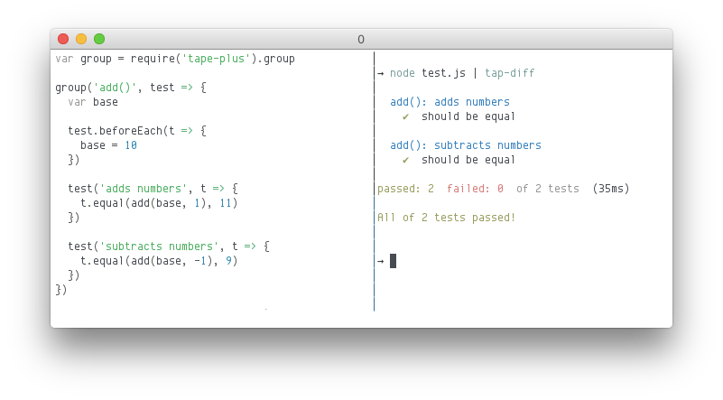

# tape-plus

> Nested tape tests with before/after, async, and promise support



tape-plus is a wrapper for [tape][] for a batteries-included experience for writing elegant tape tests. It provides a user-friendly API modeled after Mocha.

[](https://travis-ci.org/rstacruz/tape-plus "See test builds")

[tape]: https://npmjs.com/package/tape

## Install

[tape][] is a peer dependency of tape-plus. Install them together.

```sh
npm install --save-dev tape tape-plus
```

## Usage

Use `require('tape-plus')` as a substitute for `require('tape')`. The only difference is you don't need to use `t.end()` anymore.

```js
var test = require('tape-plus')

test('adding numbers', t => {
  t.equal(10, 10)
})
```

### Grouped tests

Use `test.group` to define test groups.

```js
var group = require('tape-plus').group

group('add()', test => {
  test('adding', t => {
    t.equal(add(1, 1), 2)
  })

  test('subtracting', t => {
    t.equal(add(10, -1), 9)
  })
})
```

### Nested groups

You can also make groups within groups. Just call `test.group` again.

```js
var group = require('tape-plus').group

group('add()', test => {
  test.group('adding', test => {
    test('positive numbers', t => {
      t.equal(add(10, 10), 20)
    })

    test('negative numbers', t => {
      t.equal(add(-10, -10), -20)
    })
  })
})
```

### Before/after hooks

Use `test.beforeEach` and `test.afterEach` to add hooks.

```js
var group = require('tape-plus').group

group('add()', test => {
  var base

  test.beforeEach(t => {
    base = 10
  })

  test.afterEach(t => {
    // ...
  })

  test('adds numbers', t => {
    t.equal(add(base, 1), 11)
  })

  test('subtracts numbers', t => {
    t.equal(add(base, -1), 9)
  })
})
```

### Asynchronous tests

Pass a second parameter to `test()` and it'll be a callback, Mocha-style.

```js
var group = require('tape-plus').group

group('add()', test => {
  var base

  test('async callback', (t, next) => {
    setTimeout(() => {
      t.equal(1, 1)
      next()
    })
  })
})
```

### Promises

Return a promise from inside a `test()` block. Rejected promises will be an error.

```js
var group = require('tape-plus').group

test('async callback', t => {
  return fetch('http://site.com')
  .then(data => {
    t.equal(data, '<html></html>')
  })
})
```

### BDD interface

`test.describe` is an alias for `test.group`.

```js
var describe = require('tape-plus').describe

describe('add()', it => {
  it('adds numbers', t => {
    t.equal(add(1, 1), 2)
  })

  it('subtracts numbers', t => {
    t.equal(add(10, -1), 9)
  })
})
```

### With other tape wrappers

tape-plus is implemented as a decorator, so you can mix it in with other stuff. Here's an example with [extend-tape](https://www.npmjs.com/package/extend-tape).

```js
var test = require('tape')

test = require('extend-tape').default(test, { /*...*/ })
test = require('tape-plus/wrap')(test)
```

## Thanks

**tape-plus** © 2016+, Rico Sta. Cruz. Released under the [MIT] License.<br>
Authored and maintained by Rico Sta. Cruz with help from contributors ([list][contributors]).

> [ricostacruz.com](http://ricostacruz.com) &nbsp;&middot;&nbsp;
> GitHub [@rstacruz](https://github.com/rstacruz) &nbsp;&middot;&nbsp;
> Twitter [@rstacruz](https://twitter.com/rstacruz)

[MIT]: http://mit-license.org/
[contributors]: http://github.com/rstacruz/tape-plus/contributors
